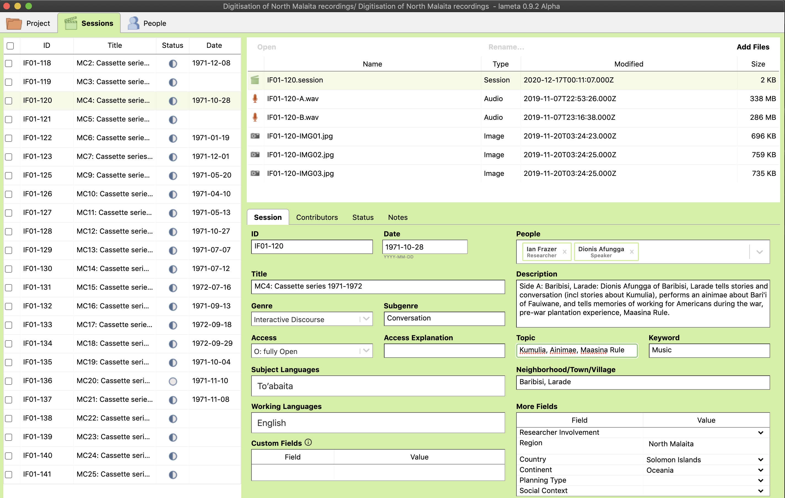

# Data Management Suggestions for Archiving with PARADISEC or other archives

  

## Metadata management tools

[PARADISEC-configured Spreadsheet](http://www.paradisec.org.au/wp-content/uploads/2020/10/PDSCMinimalMetadata2020.xlsx) - Clicking the link will begin the download of the this preconfigured spreadsheet. All fields necessary to create catalog items in PARADISEC are included. 
> Note:  Rows in the PARADISEC spreadsheet are meant to capture metadata at the level of an item, or recording session. Do not list individual file information.

[LaMeta](https://github.com/onset/laMETA/releases) - LaMeta will allow you to create .imdi metadata files via a simple graphical interface.  

  

