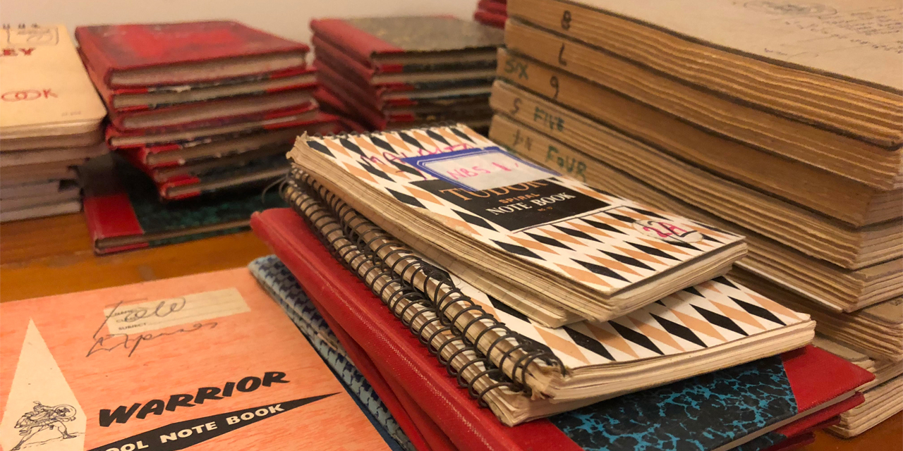
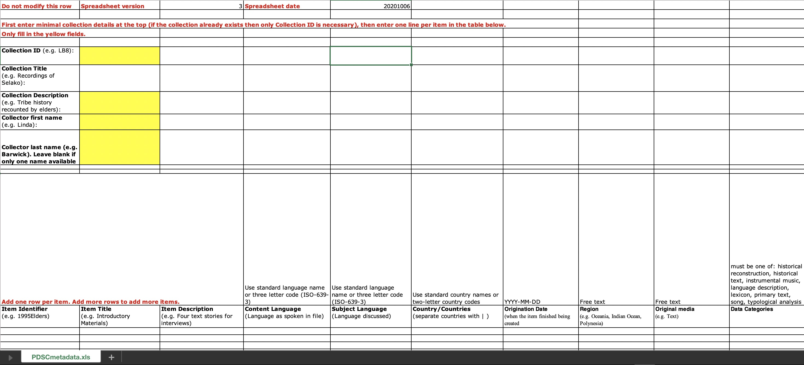

# Data Management Suggestions for Archiving with PARADISEC or other archives

  

Most of this is geared toward preparing your collection for [PARADISEC (Pacific and Regional Archive for Digital Sources in Engangered Cultures)](https://www.paradisec.org.au/), but some of the organisational concepts can be applied to depositing with other archives such as [The Endangered Language Archive (ELAR)](https://elar.soas.ac.uk/) or [The Language Archive (TLA)](https://archive.mpi.nl/tla/).

## Metadata management tools

At this time there are two metadata tools that we are supporting. LaMeta is still being improved with each new version, so some newly added features may not function as expected (such as the PARADISEC export function). Follow the links below to get the most recent versions. 

**PARADISEC-configured Spreadsheet** - Right-click on this [link](http://www.paradisec.org.au/wp-content/uploads/2020/10/PDSCMinimalMetadata2020.xlsx) to save the PARADISEC pre-configured spreadsheet. All fields necessary to create catalog items in PARADISEC are included. 
> Note:  Rows in the PARADISEC spreadsheet are meant to capture metadata at the level of an item, or recording session. Do not list individual file information.

  

**LaMeta** - This free software will allow you to create .imdi metadata files via a simple graphical interface. Follow this [link](https://github.com/onset/laMETA/releases) to download the latest version. If you need guidance using LaMeta, take a look at this helpful [site](https://sites.google.com/site/metadatatooldiscussion/). The LaMeta metadata export lends itself for archiving with [ELAR](https://elar.soas.ac.uk/); however, there is an option to export the project metadata in a CSV that is formatted for PARADISEC. This funtion is in the early stages and your export may require some cleaning up.

  

